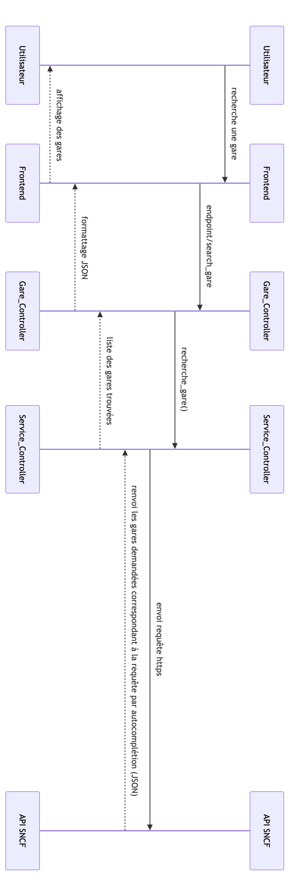
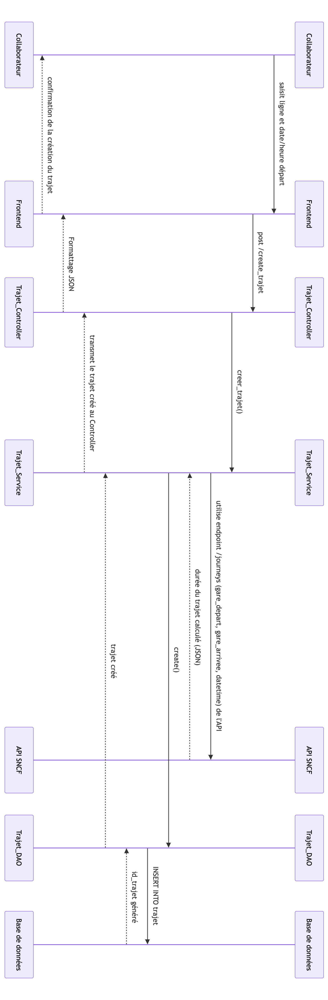
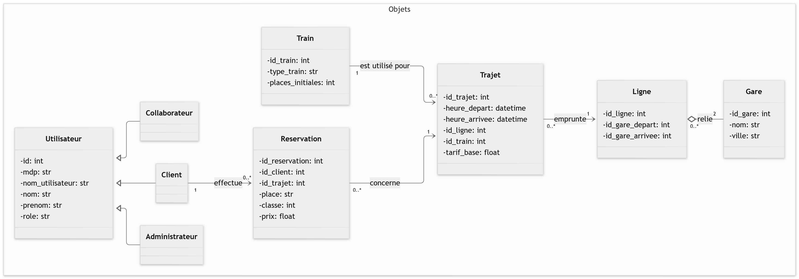
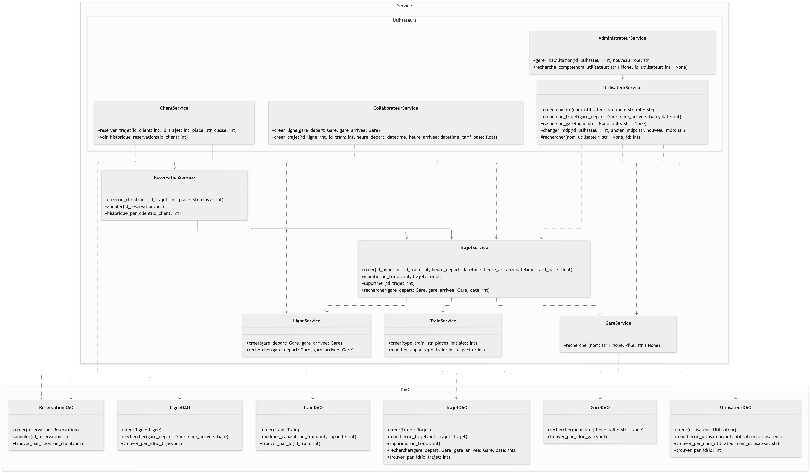

---
format:
  pdf:
    include-in-header: 
      text: |
        \usepackage{graphicx}
    geometry:
      - top=30mm
      - left=25mm
      - right=25mm
      - bottom=30mm
execute:
  echo: false
  warning: false
editor: 
  markdown: 
    wrap: 72
lang: fr
---

\begin{titlepage}
\centering


% Logo
\includegraphics[width=7cm]{ensai-logo.png}\par

\vspace{1.5cm}

% Titre principal
{\Huge Rapport d'analyse - Projet informatique \par}
\vspace{0.5cm}
{\Large 2A \par}

\vspace{1.5cm}

% Sous-titre / Nom de l'application
{\LARGE \textbf{Concurrent SNCF} \par}

\vspace{1cm}

% Bloc Étudiants (aligné à gauche)
\begin{flushleft}
\large
\textbf{Étudiants :}\\
Adam BENAMER\\
Satya KREMER\\
Nathan TIATIA\\
Laurine LEROY\\
Lou-Ann CLEMENT\\
Nour NSIRI
\end{flushleft}

\vspace{0.05cm}

% Bloc Encadrant 
\begin{flushright}
\large
\textbf{Encadrant pédagogique :}\\
KEVIN LEROY
\end{flushright}


\vfill

% Année universitaire
{\normalsize Année universitaire 2026--2027 \par}

\end{titlepage}
\tableofcontents
\newpage

# Introduction

# Cahier des charges

Notre sujet s’intitule Concurrence SNCF : il s’agit donc bien de créer
une application qui propose a minima les mêmes services et
fonctionnalités qu’une application de la SNCF. Ce cahier des charges
précisent lesquels de ces services nous allons garantir, et quels
services sont optionnels, non prioritaires, et seront donc développés
après les fonctionnalités nécessaires à l’application. Les contraintes
explicites du sujet précisent quelles doivent être ces fonctionnalités,
organisées autour de trois principaux types d’utilisateurs, et nous
allons donc développer quelles sont ces contraintes. De plus, nous
exposerons nos réflexions et questionnements autour de celles-ci lors de
la phase de développement.

Nous allons tout d’abord nous pencher sur les utilisateurs auxquels
s’adresse notre application. Ils sont séparés en trois catégories bien
distinctes. Ces trois types de comptes gardent les mêmes attributs, mais
ont accès à différentes actions selon leur niveau d’habilitation (en
dehors de la création de compte, qui est une action commune aux trois
types d’utilisateurs).

Les clients peuvent rechercher des trajets, en entrant une gare de
départ et une gare d’arrivée. Les collaborateurs quant à eux peuvent
créer, modifier et supprimer des lignes d’exploitation, encore une fois
en entrant une gare de départ et une gare de terminus. Enfin, les
administrateurs peuvent changer les niveaux d’habilitation des comptes,
et faire passer les clients au niveau de collaborateur, ou à l’inverse
faire passer un collaborateur au niveau de client.

Nous devons ensuite nous intéresser aux fonctionnalités que notre
application doit être en mesure de proposer. Les fonctionnalités
obligatoires sont au nombre de 5.

La première fonctionnalité est une fonctionnalité de gestion des comptes
utilisateurs, afin d’avoir les différents types que nous venons de
lister. Le code doit donc contenir des classes différentes pour chaque
type d’utilisateur, les permettant d’effectuer leur différents rôles.
Nous nous sommes questionnés brièvement sur la nécessité de permettre
aux comptes utilisateurs une modification de leur mot de passe, mais
avons préféré faire l’impasse sur cette option qui est de faible
d’utilité par rapport au but de cette application, qui est de
concurrencer la SNCF. De plus, nous avons hésité entre une recherche par
identifiant et niveau d’habilitation ou par identifiant pour la
recherche des comptes par les administrateurs, et avons décidé de
développer les deux possibilités, qui nous semblent toutes les deux
faisables sans trop de difficulté.

La deuxième fonctionnalité demandée est celle de gestion des lignes
d’exploitation. Cela est effectué par les comptes collaborateurs, en
utilisant l’API externe de la SNCF. Une réflexion a donc été engagée
autour de la synchronisation entre données venant de l’API SNCF et base
de données propre à notre projet. Si nous avons dans un premier temps
envisagé une actualisation automatisée de cette synchronisation en
transférant à intervalles réguliers les données de l’API SNCF sur la
base de données, nous avons préféré opter pour une mise à jour plus
ponctuelle. En effet, nous trouvons plus judicieux et moins onéreux en
terme de temps de n’ajouter des données sur la base de données à partir
de l’API SNCF que lorsque ces données sont demandées par un utilisateur.
Enfin, cette fonctionnalité nous demande aussi de mettre en place un
mécanisme d’auto-complétion lors de l’entrée des gares, afin de
permettre à l’utilisateur de vérifier qu’elles existent bel et bien.
Cette auto-complétion est aussi en lien avec la question de la
synchronisation base de données et API SNCF : il s’agit de savoir si
l’auto-complétion peut être mise en place lors d’une recherche sur l’API
SNCF. Si cela nous a dans un premier temps aiguillé vers notre autre
solution de synchronisation, nous avons préféré rester sur notre autre
option, que nous pensons compatible avec l’auto-complétion. Si cependant
cela s’avérerait trop complexe à mettre en place, nous basculerons vers
la synchronisation automatique.

La troisième fonctionnalité que nous devons implémenter est celle de
gestion des trajets proposés. Un trajet se trouve sur une ligne, et
possède donc une date et une heure de départ, un nombre de places et un
tarif. Le temps de trajet sera calculé avec l’API SNCF, comme demandé
dans le sujet, tandis que le nombre de places et le tarif pourront être
des variables à ajuster selon les autres fonctionnalités non
obligatoires qui pourront être mises en place (comme par exemple une
tarification transparente ou au contraire dynamique, dépendant du nombre
de places restantes). En plus de cela, il sera important de vérifier
qu’un trajet peut bel et bien être effectué entre deux gares, et qu’il
existe donc une ligne déjà créée par le compte collaborateur qui permet
ce trajet. Enfin, les comptes collaborateurs seront capables de modifier
ou bien de supprimer un trajet.

La quatrième fonctionnalité est celle de recherche de trajet : un compte
client peut rechercher les trajets créés grâce à la fonctionnalité
précédente, en entrant une gare d’arrivée et une gare de départ. Encore
une fois l’auto-complétion est un composant nécessaire de cette
fonctionnalité. A l’issu de cette recherche, toutes les informations
nécessaires lors de la création d’un trajet doivent être visibles par le
client, à l’exception du tarif et des places (qui peuvent être néanmoins
visibles dans le cas où la fonctionnalité optionnelle de réservation des
trajets est mise en place). Nous avons brièvement réfléchi à la
possibilité de prendre en charge des cas de correspondances pour relier
des villes avec deux lignes différentes dans un même trajet, mais la
complexité de cette idée l’a rendue peu réalisable dans le cadre de ce
projet aux yeux de notre équipe.

La cinquième et dernière fonctionnalité est obligatoire mais laissée
libre. C’est une fonctionnalité dédié au positionnement commercial –
c’est entre autre grâce à cela que notre application doit pouvoir
« faire concurrence » à la SNCF. Dans le sujet, des exemples et idées
sont données, tel que la tarification transparente ou le nombre de
places restantes sur un trajet, mais d’autres idées sont envisageables.
Nous avons notamment eu comme idée de donner une liste des transports
urbains aux alentours des gares, l’API SNCF fournissant quelques données
sur cela (certaines données de la RATP sont incluses parmi les données
fournies par cette API). Cette fonctionnalité, en fonction de l’avancée
du reste du projet, pourra contenir plusieurs de ces idées.

A ces fonctionnalités obligatoires s’ajoutent les fonctionnalités
optionnelles de réservation de trajet (dans laquelle un compte client
peut réserver un trajet, visualiser l’entièreté de ses réservations
qu’elles soient passées ou présentes, et annuler des réservations) et de
classes de voyage (qui bénéficient de tarifications différentes, et
peuvent être choisies lors de la réservation du client, et dépendent
donc de la présence de la fonctionnalité précédente). A l’instar de la
dernière fonctionnalité obligatoire, ces fonctionnalités optionnelles
pourront être mises en place, à différents niveaux de complexité, selon
le temps restant après avoir donné la priorité aux fonctionnalités
obligatoires.

Le sujet délimite notre périmètre d’action quant à la programmation
durant ce projet. Il est explicitement demandé de ne pas développer le
frontend de l’application : « Les webmasters de votre entreprise
prennent en charge le développement de l’interface utilisateur, il vous
reste uniquement à charge le développement d’une API ». La seule
fonctionnalité que nous codons est l’API backend. Par conséquent, nous
pensons d’abord privilégier le développement de l’application sans
interface graphique. Il est cependant possible que nous développions ce
dernier si le temps nous le permet.

Sur ce point, la contrainte temporelle est importante. Nous disposons
jusqu’à la semaine du 16 novembre pour rendre le code sous sa forme
finale et jusqu’à la semaine du 07 décembre pour préparer notre
soutenance. À compter du dépôt du dossier d’analyse, il nous reste ainsi
respectivement 9 et 12 semaines pour nous préparer. Il faut aussi
prendre en compte le fait que notre scolarité à l’ENSAI ne nous permet
pas d’utiliser notre temps comme nous l’aurions voulu, étant donné
l’emploi du temps de chacun. Cette contrainte prise en compte, il nous
faut privilégier la qualité des fonctionnalités et les bonnes pratiques
que l’on développe : « Une application développée proprement et dans le
respect des bonnes pratiques est toujours préférable à un nombre de
fonctionnalités (préférez la qualité, quite à laisser de côté une des
fonctionnalités) ».

Quant-aux fonctionnalités, 5 sont obligatoires, tandis que les autres
sont optionelles, nous laissant le choix libre sur d’autres
fonctionnalités à coder. Nous les avons spécifiés précédemment. Celles
obligatoires nous resteignent davantage dans la création des classes
objet. Par exemple avec la classe Client, Collaborateur et
Administrateur, explicitement demandé pour la fonctionnalité 1. Encore
une fois, on rappelle le critère de qualité nécéssité pour la mise en
forme du code des fonctionnalités.

Notons que notre base de données est alimenté par l’API de la SNCF. Cela
signifie que les données sont importées depuis l'API. Grâce à cette
dernière, nous construirons les classes objets ainsi que leurs attributs
et méthodes. Nous avons alors obtenu un token d’authentification pour
cette API. L’API SNCF nous permet d’obtenir des données concernants les
trajets et les gares relatif à notre sujet. Par la suite ces données
nous permettent de compléter notre diagramme UML avec de nouvelles
classes objets dont trajet et gare.

Enfin, il est important de mentionner à nouveau que la partie front end
de l’application n’est pas obligatoire, et passe donc à la fin de la
liste des tâches lors de la réalisation de ce projet. De plus, elle
pourra être réalisée en partie en vibe-coding, en s’appuyant sur des
outils d’intelligence artificielle.

Afin de réaliser tout ces composants, des rôles ont été distribués dans
le groupe, afin d’organiser au mieux notre travail durant le semestre à
venir. Le rôle de cheffe de projet a été attribué à Lou-Ann Clement,
tandis que le rôle de tech leader sera partagé entre Satya Kremer et
Nour Nsiri. Nous coderons en Python sur vscode, en ayant recours à Git
pour versionner notre code. Pour la base de données, nous aurons recours
à PostGreSQL.

# Diagramme d'architecture

```{r}
#| cache: true
#| label: fig-architecture
#| fig-cap: "Diagramme d'architecture de l'application"
#| fig-pos: "H"
#| echo: false
#| out-width: "100%"

knitr::include_graphics("diagramme_architecture.png")
```

Le diagramme d'architecture ci-dessus illustre la structuration de notre
solution logicielle pour notre compagnie ferroviaire. Le système repose
sur une architecture client-serveur classique, séparant l'interface
utilisateur, le Front-end et la logique métier et de la gestion des
données, le Back-end. Au sein du Back-end, nous avons donc :

Le Controller, qui est le point d'entrée de notre API. Il intercepte les
requêtes HTTP envoyées par le navigateur, vérifie les habilitations, et
retourne les réponses au format JSON.

Le Service, c’est la couche métier. Il contient toute la logique de
notre entreprise (vérification de la faisabilité d'un trajet, gestion
des planifications, calculs des tarifs). Il orchestre les opérations
entre le Controller, l'API SNCF et la base de données. Le DAO, cette
couche est exclusivement responsable de la communication avec notre base
de données. Elle exécute les requêtes SQL (CRUD : Create, Read, Update,
Delete) et transforme les données relationnelles en objets utilisables
par notre code.

Par ailleurs, nous avons fait le choix de ne pas interroger l'API SNCF
en temps réel à chaque requête de l'utilisateur, mais d'importer et
mettre à jour ces données dans notre propre base de données. La
principale raison de ce choix est lié à la contrainte de aide à la
saisie par autocomplétion lors de la recherche de gare par un
utilisateur. Si nous devions faire un appel HTTP vers les serveurs de la
SNCF à chaque lettre tapée par l'utilisateur, le temps de latence serait
beaucoup trop élevé. Avoir ces données en local dans notre base de
données permet des requêtes SQL quasi instantanées, garantissant une
autocomplétion fluide.

Ainsi, la mise à jour de notre base de données pourrait s’effectuer :

Soit à l'initialisation : Un script vérifie et met à jour les données
manquantes au lancement de l'application. Soit via une tâche planifiée :
Le système effectuera une mise à jour ponctuelle en arrière-plan (par
exemple, une synchronisation hebdomadaire chaque dimanche à 3h du
matin).

# Diagrammes d'activité

Afin de concevoir une API robuste et centrée sur les besoins du métier,
nous avons modélisé les processus à travers trois diagrammes d'activité
correspondant aux différents niveaux d'habilitation. Les informations en
bleu clair correspondent à des fonctionnalités optionnelles et peuvent
ne pas être finalement conservées.

## Administrateur

```{r}
#| cache: true
#| label: fig-admin
#| fig-cap: "Diagramme d'activité de l'administrateur"
#| fig-pos: "H"
#| echo: false
#| out-width: "50%"

knitr::include_graphics("diagramme_administrateur.png")
```

Le premier schéma illustre le parcours de l'administrateur, dont le rôle
de supervision est restreint et sécurisé. Ce dernier peut rechercher un
compte utilisateur spécifique pour consulter son statut actuel, puis
augmenter ou diminuer son niveau d'habilitation, par exemple pour
promouvoir un client en collaborateur. Le système intègre directement
les règles de gestion métier en vérifiant la validité des saisies et en
garantissant l'impossibilité de modifier les droits d'un autre
administrateur avant de confirmer la transaction en base de données.

## Client

```{r}
#| cache: true
#| label: fig-client
#| fig-cap: "Diagramme d'activité du client"
#| fig-pos: "H"
#| echo: false
#| out-width: "70%"
#| out-height: "17cm"

knitr::include_graphics("diagramme_client.png")
```

Le deuxième schéma modélise l'expérience utilisateur finale avec le
parcours du client, conçu pour être fluide et intégrer des
fonctionnalités optionnelles. Le client entame un tunnel de recherche en
saisissant ses critères de gares et de dates, avec des validations en
temps réel qui lui permettent de modifier facilement sa requête si un
trajet s'avère complet sans devoir tout recommencer. Une fois le trajet
trouvé, il accède à la réservation où il peut choisir entre une classe
classique ou premium selon les disponibilités. Le client a également la
capacité de consulter l’historique de ses réservations au début de
l’interface.

## Collaborateur

```{r}
#| cache: true
#| label: fig-collabo
#| fig-cap: "Diagramme d'activité du collaborateur"
#| fig-pos: "H"
#| echo: false
#| out-width: "70%"
#| out-height: "17cm"

knitr::include_graphics("diagramme_collaborateur.png")
```

Enfin, le dernier diagramme détaille le cœur de l'activité
d'exploitation ferroviaire à travers le parcours du collaborateur,
divisé en deux axes de gestion. D'une part, le collaborateur peut créer
une nouvelle ligne en indiquant la gare de départ et d’arrivée ainsi que
la date et l’heure de cette nouvelle ligne. Il alloue également un
nombre de places à chacune de ses classes. D’autre part, il a la
possibilité de chercher un trajet existant afin de modifier (l’horaire,
la gare de départ ou d’arrivée, le nombre de places disponible pour
chaque classe) ou de supprimer une ligne.

# Diagramme de Gantt

```{r}
#| cache: true
#| label: fig-gantt
#| fig-cap: "Diagramme de Gantt"
#| fig-pos: "H"
#| echo: false
#| out-width: "100%"


knitr::include_graphics("diagramme_Gantt.png")
```

# Diagrammes de séquences

Les diagrammes de séquences ci-dessous représentent des cas
d’utilisations de notre application. Nous y faisons figurer les
relations et interactions entre les différentes couches de
l’architecture du projet. Ces diagrammes partent de l’action d’un
utilisateur qui sélectionne une option sur l’interface de l’application,
cette dernière lui renvoyant ensuite la confirmation que son action a
été effectué. Les séquences utilisent le protocole HTTPS pour
communiquer avec l’API et, dans le cas où cela est nécessaire, le
langage SQL pour la base de données.

Le premier diagramme de séquence représente l’action de rechercher une
gare. L’utilisateur, choisit l’option de recherche par autocomplétion
dans l’interface. Cette demande utilisera un endpoint sous forme d’un
protocole HTTPS à l’API de la SNCF, dont nous nous munirons grâce à la
documentation sur l’API. Les gares stockées dans l’API et correspondant
à la recherche sont renvoyés sous forme de liste au format JSON. Enfin
ces gares sont affichés à l’utilisateur via l’interface de
l’application.

Le second diagramme explicite l’action d’un collaborateur cherchant à
ajouter un trajet. En saisissant les informations nécessaires sur
l’interface, le collaborateur permet aux différentes couches de créer le
trajet, notamment en calculant automatiquement la durée du trajet à
l’aide de l’API. Pour cela on utilise de nouveau un endpoint HTTPS de la
documentation API (/journeys). Cette fois-ci l’action utilise la couche
DAO et la base de données avec les données spécifiques à l’application.
La couche DAO utilise la fonction create avant d’utiliser le langage SQL
pour rajouter ce trajet (INSERT INTO) et créer les atributs de ce
nouveau trajet (dont l’id). De nouveau, la séquence se termine par la
confirmation que le trajet vient d’être créer.

```{r}
#| cache: true
#| label: fig-seq1
#| fig-cap: "Diagramme de séquence: rechercher une gare"
#| fig-pos: "H"
#| echo: false
#| out-width: "100%"



```

```{r}
#| cache: true
#| label: fig-seq2
#| fig-cap: "Diagramme de séquence: création de trajet"
#| fig-pos: "H"
#| echo: false
#| out-width: "100%"



```

# Diagramme de classes

Pour concevoir cette application, il est nécessaire d'implémenter les
classes correspondant aux fonctionnalités attendues. La première étape
consiste à définir les classes représentant les objets métier manipulés
par l'application.

```{r}
#| cache: true
#| label: fig-class1
#| fig-cap: "Diagramme de classes : objets"
#| fig-pos: "H"
#| echo: false
#| out-width: "100%"



```

Le diagramme ci-dessus présente ces classes objets, avec leurs attributs
et les relations qui les lient. Elles permettent de modéliser les
différents objets mobilisés lors de l'utilisation de l'application,
telles qu'un utilisateur, une réservation ou un trajet. En premier lieu,
la classe Utilisateur représente un utilisateur de l’application. Un
utilisateur est défini par son identifiant unique (id), et possède un
nom d’utilisateur, un mot de passe et son rôle. L’utilisateur peut être
avoir le statut (role) de client, collaborateur ou administrateur sur
l’application, modélisés par les classes filles correspondantes, ce qui
permettra d’implémenter des fonctionnalités différentes pour les
utilisateurs en fonction de leur niveau d’habilitation. La classe
Reservation, associée à la classe client, modélise les réservations
effectuées sur l’application. Elle contient les attributs
`id_reservation`, l’`id_client` du client à son origine, `id_trajet` qui
permet d’associer le trajet concerné, le numéro de place, la classe (1
ou 2 pour première ou seconde) ainsi que le prix du billet réservé.
Client et Reservation sont reliés par une relation d’association et non
de composition car, si la réservation dépend en effet obligatoirement
d’un client et n’existe pas sans lui, on peut considérer que si un
client supprime son compte, il peut être utile que l’historique de ses
réservations puisse être tout de même conservé, par exemple par souci de
comptabilité. La classe Reservation est associée à une classe Trajet
permettant de modéliser un trajet sur une ligne (une ligne reliant deux
gares) pour une date et heure données. Un trajet est ainsi défini par
son identifiant, ses heures d’arrivée et de départ (format datetime qui
permet de mentionner à la fois la date et l’heure), les identifiants du
train et de la ligne concernés ainsi que le tarif de base pour ce
trajet. Une classe Train est également associée à la classe Trajet. Elle
indique l’identifiant du train, le type de train et le nombre de places
initial à bord. Cette classe permettra de gérer plus facilement le
nombre de places restantes, et de prendre en compte, par exemple, les
capacités variant selon le type de train. La classe Ligne, associée à
Trajet, permet de modéliser le lien entre deux gares entre lesquelles il
est possible de voyager (il n’existe pas une ligne pour chaque couple de
gares possible). Elle a comme attributs l’identifiant de la ligne
`id_ligne` ainsi que les identifiants des gares d’arrivée et de départ.
Pour simplifier la gestion des lignes, on a décidé de considérer que
l’ordre départ/arrivée compte, et donc, par exemple, que Paris -\>
Rennes et Rennes -\> sont deux lignes différentes. La classe Gare
représente une gare, avec son identifiant, son nom et la ville où elle
se situe. Elle est reliée à la classe Ligne par une relation
d’agrégation, car une ligne contient des gares mais la gare existe bien
indépendamment de la ligne. Une gare peut appartenir à plusieurs lignes,
et une ligne comprend deux gares.

```{r}
#| cache: true
#| label: fig-class2
#| fig-cap: "Diagramme de classes : classes services et DAO"
#| fig-pos: "H"
#| echo: false
#| out-width: "100%"



```

**La couche Service**

D’autres classes sont nécessaires pour gérer ces objets : les classes
Service (diagramme ci-dessus). Les classes Service liées aux
utilisateurs (UtilisateurService, ClientService, CollaborateurService et
AdministrateurService) permettent de gérer les actions des utilisateurs
et de les répercuter ensuite sur les objets concernés. La classe
UtilisateurService contient les méthodes `creer_compte()`,
`recherche_trajet()`, `recherche_gare()` et `changer_mdp()`. Elles
permettent de gérer ces actions, qui correspondent aux fonctionnalités
disponibles pour tous les utilisateurs, quel que soit leur rôle. Il y a
également la méthode `rechercher()`, qui est déclarée en visibilité
protégée, car elle n'est pas destinée à être appelée directement par un
utilisateur final, mais uniquement par AdministrateurService dans le
cadre de `recherche_compte()`. La classe ClientService contient la
méthode `reserver_trajet()`, qui permet à un client d’effectuer une
réservation, ainsi que `voir_historique_reservations()` qui lui permet
de consulter l’ensemble de ses réservations passées. Ces deux méthodes
correspondent aux actions spécifiques au rôle de client. La classe
CollaborateurService regroupe les méthodes `creer_ligne()` et
`creer_trajet()` qui permettent à un collaborateur d’ajouter une
nouvelle ligne ferroviaire ou un nouveau trajet sur le réseau. La classe
AdministrateurService contient les méthodes `gerer_habilitation()`, qui
permet de modifier les droits d'accès d'un utilisateur (de changer
l’attribut `role` d’un utilisateur), et `recherche_compte()`, qui permet
de retrouver un compte utilisateur (par id ou nom d’utilisateur). Par
ailleurs, d'autres classes Service permettent de gérer les objets métier
: ReservationService, TrajetService, LigneService, GareService et
TrainService. Chacune centralise les opérations propres à son objet
(création, modification, suppression, recherche). Les liens représentés
par des flèches en pointillés traduisent une relation de dépendance
entre les classes, lorsqu’une classe Service fait appel aux méthodes
d'une autre classe Service pour accomplir son action, sans pour autant
en hériter ni la posséder. Ainsi, ClientService dépend de
ReservationService puisque `reserver_trajet()` doit, en interne, appeler
la méthode `creer()` de ReservationService pour enregistrer la
réservation. ClientService dépend également de TrajetService, car avant
de réserver, il faut pouvoir vérifier l'existence et la disponibilité du
trajet concerné, en passant par la méthode `rechercher()` de
Reservation. De la même manière, UtilisateurService dépend de
TrajetService et de GareService. CollaborateurService dépend de
LigneService (pour creer_ligne(), qui appelle LigneService.creer()) et
de TrajetService (pour creer_trajet(), qui appelle
TrajetService.creer()). De plus, Enfin, au sein même des classes Service
liées aux objets métier, ReservationService dépend de TrajetService
(pour vérifier la disponibilité du trajet avant de confirmer ou
d'annuler une réservation), et TrajetService dépend à la fois de
LigneService, GareService et TrainService, puisqu'un trajet est défini
par rapport à une ligne, à des gares de départ/arrivée et à un train
donné : la création ou la modification d'un trajet nécessite donc de
solliciter ces trois services.

**La couche DAO**

Enfin, chaque classe Service dépend de sa classe DAO correspondante
(UtilisateurDAO, ReservationDAO, TrajetDAO, LigneDAO, GareDAO,
TrainDAO), chargée d’interagir avec la base de données. Les classes
Service orchestrent les traitements et appellent les méthodes de
création, modification, suppression ou recherche exposées par leur DAO,
et ce sont ensuite les classes DAO elles-mêmes qui font appel aux
données ou stockent les nouvelles informations créées dans la base.
