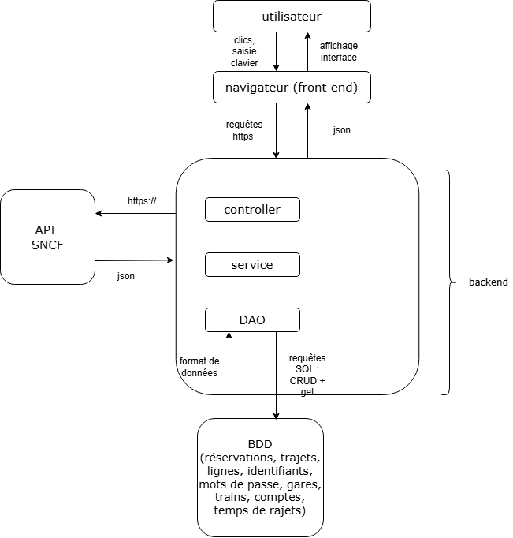
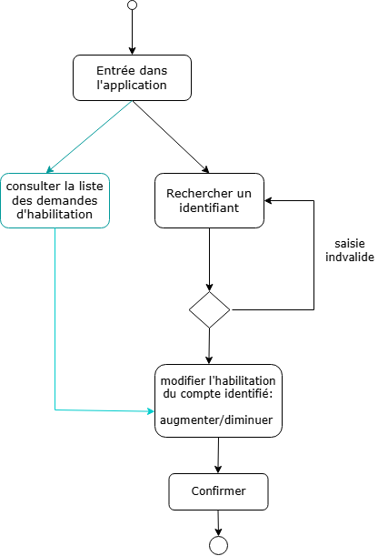
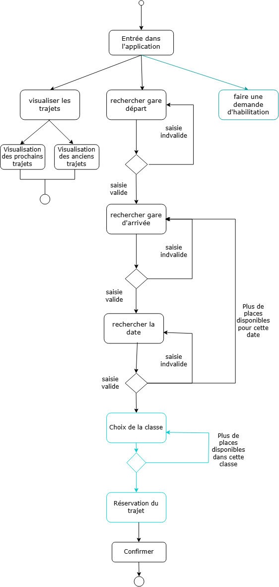
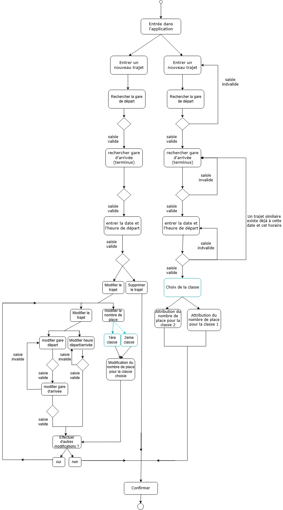
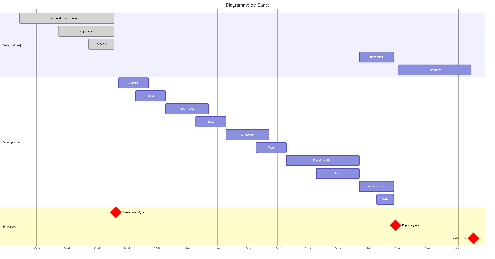

---
format:
  pdf:
    include-in-header: 
      text: |
        \usepackage{graphicx}
    geometry:
      - top=30mm
      - left=25mm
      - right=25mm
      - bottom=30mm
execute:
  echo: false
  warning: false
editor: 
  markdown: 
    wrap: 72
lang: fr
---

\begin{titlepage}
\centering


% Logo
\includegraphics[width=7cm]{ensai-logo.png}\par

\vspace{1.5cm}

% Titre principal
{\Huge Rapport d'analyse - Projet informatique \par}
\vspace{0.5cm}
{\Large 2A \par}

\vspace{1.5cm}

% Sous-titre / Nom de l'application
{\LARGE \textbf{Concurrent SNCF} \par}

\vspace{1cm}

% Bloc Étudiants (aligné à gauche)
\begin{flushleft}
\large
\textbf{Étudiants :}\\
Adam BENAMER\\
Satya KREMER\\
Nathan TIATIA\\
Laurine LEROY\\
Lou-Ann CLEMENT\\
Nour NSIRI
\end{flushleft}

\vspace{0.05cm}

% Bloc Encadrant 
\begin{flushright}
\large
\textbf{Encadrant pédagogique :}\\
KEVIN LEROY
\end{flushright}


\vfill

% Année universitaire
{\normalsize Année universitaire 2026--2027 \par}

\end{titlepage}

\tableofcontents
\newpage

# Introduction

# Diagramme d'architecture

```{r}
#| cache: true
#| label: fig-architecture
#| fig-cap: "Diagramme d'architecture de l'application"
#| fig-pos: "H"
#| echo: false
#| out-width: "100%"


```

Le diagramme d'architecture ci-dessus illustre la structuration de notre solution logicielle pour notre compagnie ferroviaire. Le système repose sur une architecture client-serveur classique, séparant l'interface utilisateur, le Front-end et la logique métier et de la gestion des données, le Back-end. 
Au sein du Back-end, nous avons donc : 

Le Controller, qui est le point d'entrée de notre API. Il intercepte les requêtes HTTP envoyées par le navigateur, vérifie les habilitations, et retourne les réponses au format JSON.

Le Service, c’est la couche métier. Il contient toute la logique de notre entreprise (vérification de la faisabilité d'un trajet, gestion des planifications, calculs des tarifs). Il orchestre les opérations entre le Controller, l'API SNCF et la base de données.
Le DAO, cette couche est exclusivement responsable de la communication avec notre base de données. Elle exécute les requêtes SQL (CRUD : Create, Read, Update, Delete) et transforme les données relationnelles en objets utilisables par notre code.

Par ailleurs, nous avons fait le choix de ne pas interroger l'API SNCF en temps réel à chaque requête de l'utilisateur, mais d'importer et mettre à jour ces données dans notre propre base de données.
La principale raison de ce choix est lié à la contrainte de aide à la saisie par autocomplétion  lors de la recherche de gare par un utilisateur. Si nous devions faire un appel HTTP vers les serveurs de la SNCF à chaque lettre tapée par l'utilisateur, le temps de latence serait beaucoup trop élevé. Avoir ces données en local dans notre base de données permet des requêtes SQL quasi instantanées, garantissant une autocomplétion fluide.  

Ainsi, la mise à jour de notre base de données pourrait s’effectuer : 

Soit à l'initialisation : Un script vérifie et met à jour les données manquantes au lancement de l'application.
Soit via une tâche planifiée : Le système effectuera une mise à jour ponctuelle en arrière-plan (par exemple, une synchronisation hebdomadaire chaque dimanche à 3h du matin).

# Diagrammes d'activité 

Afin de concevoir une API robuste et centrée sur les besoins du métier, nous avons modélisé les processus à travers trois diagrammes d'activité correspondant aux différents niveaux d'habilitation. Les informations en bleu clair correspondent à des fonctionnalités optionnelles et peuvent ne pas être finalement conservées.

## Administrateur

```{r}
#| cache: true
#| label: fig-admin
#| fig-cap: "Diagramme d'activité de l'administrateur"
#| fig-pos: "H"
#| echo: false
#| out-width: "50%"


```
Le premier schéma illustre le parcours de l'administrateur, dont le rôle de supervision est restreint et sécurisé. Ce dernier peut rechercher un compte utilisateur spécifique pour consulter son statut actuel, puis augmenter ou diminuer son niveau d'habilitation, par exemple pour promouvoir un client en collaborateur. Le système intègre directement les règles de gestion métier en vérifiant la validité des saisies et en garantissant l'impossibilité de modifier les droits d'un autre administrateur avant de confirmer la transaction en base de données. 

## Client

```{r}
#| cache: true
#| label: fig-client
#| fig-cap: "Diagramme d'activité du client"
#| fig-pos: "H"
#| echo: false
#| out-width: "70%"
#| out-height: "17cm"


```
Le deuxième schéma modélise l'expérience utilisateur finale avec le parcours du client, conçu pour être fluide et intégrer des fonctionnalités optionnelles. Le client entame un tunnel de recherche en saisissant ses critères de gares et de dates, avec des validations en temps réel qui lui permettent de modifier facilement sa requête si un trajet s'avère complet sans devoir tout recommencer. Une fois le trajet trouvé, il accède à la réservation où il peut choisir entre une classe classique ou premium selon les disponibilités. Le client a également la capacité de consulter l’historique de ses réservations au début de l’interface. 

## Collaborateur

```{r}
#| cache: true
#| label: fig-collabo
#| fig-cap: "Diagramme d'activité du collaborateur"
#| fig-pos: "H"
#| echo: false
#| out-width: "70%"
#| out-height: "17cm"


```

Enfin, le dernier diagramme détaille le cœur de l'activité d'exploitation ferroviaire à travers le parcours du collaborateur, divisé en deux axes de gestion. D'une part, le collaborateur peut créer une nouvelle ligne en indiquant la gare de départ et d’arrivée ainsi que la date et l’heure de cette nouvelle ligne. Il alloue également un nombre de places à chacune de ses classes. D’autre part, il a la possibilité de chercher un trajet existant afin de modifier (l’horaire, la gare de départ ou d’arrivée, le nombre de places disponible pour chaque classe) ou de supprimer une ligne. 


# Diagramme de Gantt
```{r}
#| cache: true
#| label: fig-gantt
#| fig-cap: "Diagramme de Gantt"
#| fig-pos: "H"
#| echo: false
#| out-width: "100%"



```


